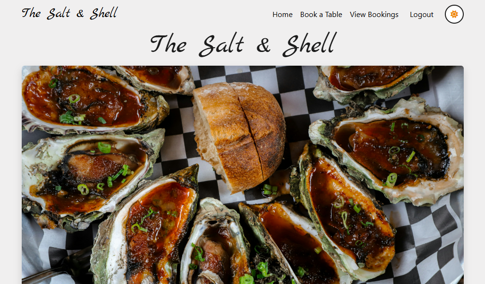
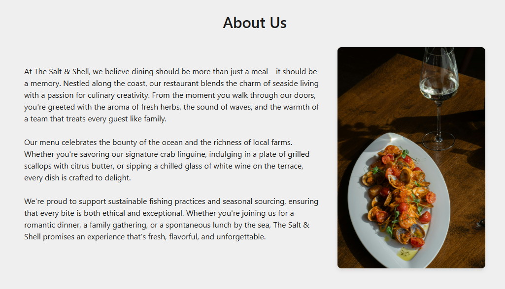
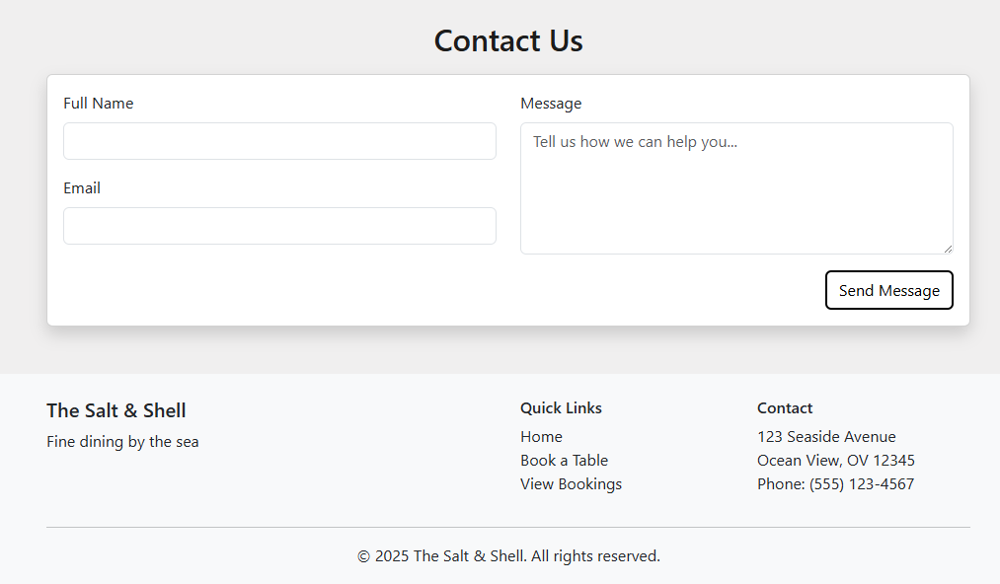
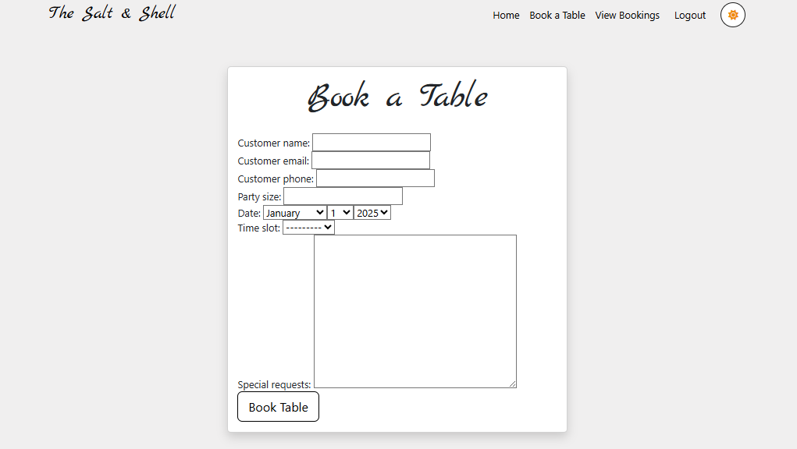
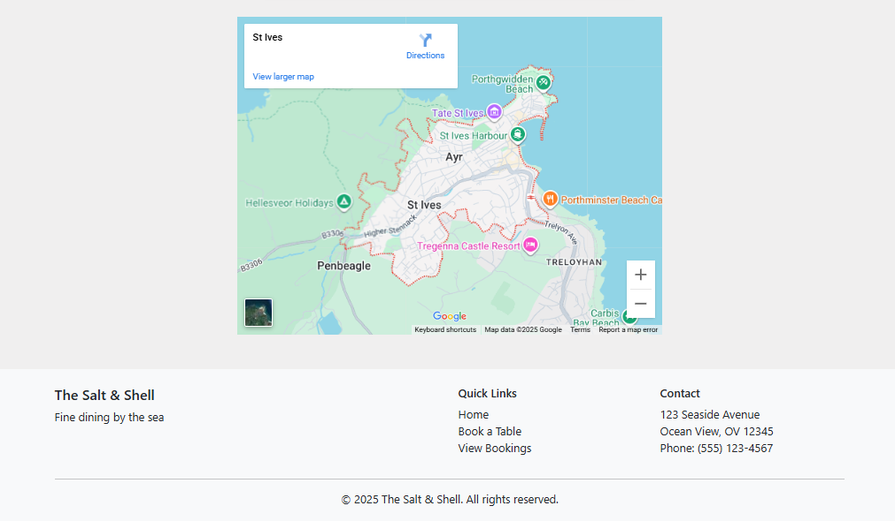
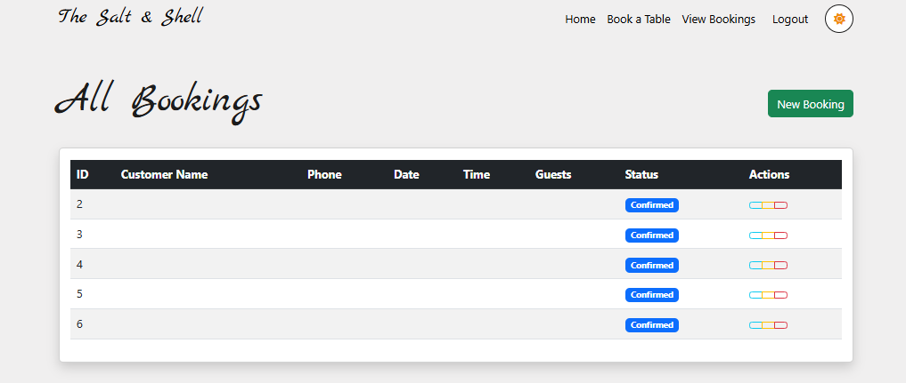
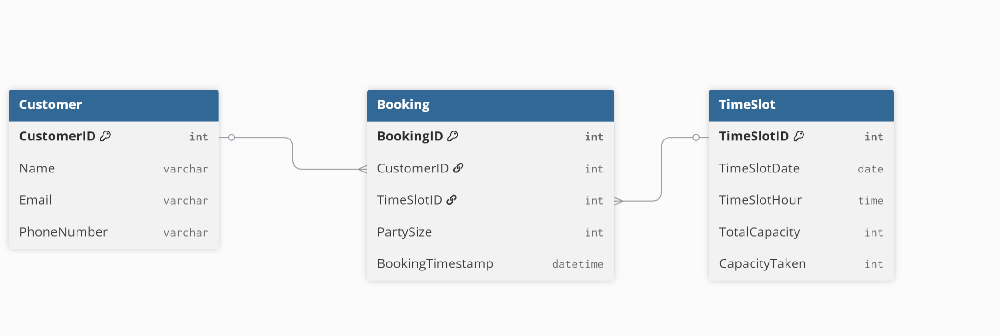
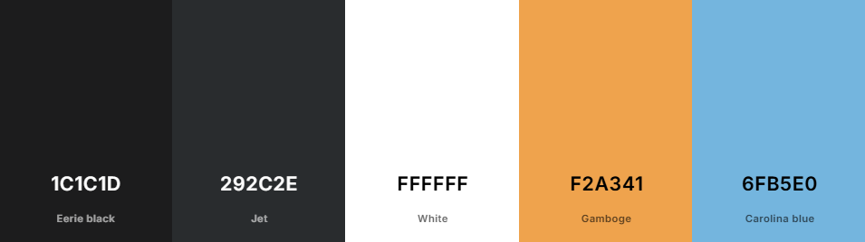
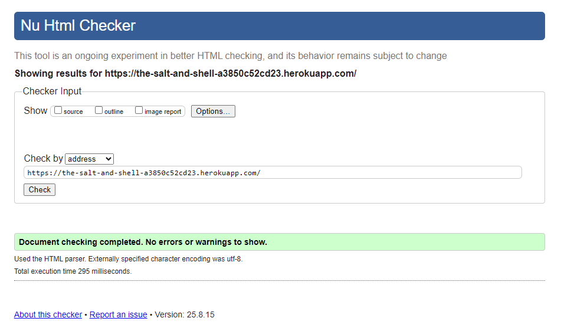
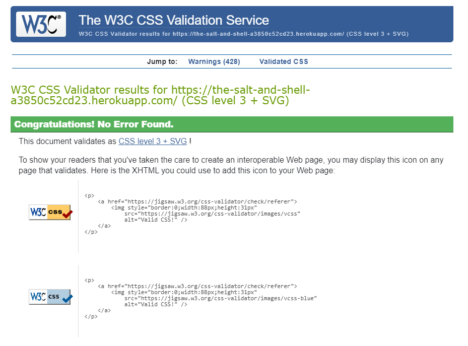

# The Salt and Shell

## 🏨 Restaurant Booking App

A Django-based web application for managing restaurant bookings, customer information, and timeslots. The project streamlines the reservation process for both customers and staff, providing an intuitive interface and robust backend.


**Deployed Site** - https://the-salt-and-shell-a3850c52cd23.herokuapp.com/

---

## 📑 Table of Contents

-   [📝 Project Overview](#-project-overview)
-   [✨ Features](#-features)
-   [� Screenshots](#-screenshots)
-   [�🗄️ Database Design](#-database-design)
-   [🚢 Deployment & Setup](#-deployment--setup)
    -   [Heroku Deployment](#heroku-deployment)
    -   [🌀 Cloning the Repository](#-cloning-the-repository)
    -   [🍴 Forking the Repository](#-forking-the-repository)
    -   [⚙️ Running the Project Locally](#-running-the-project-locally)
-   [🎨 Design & User Interface](#-design--user-interface)
-   [🤖 AI Assistance & Benefits](#-ai-assistance--benefits)
-   [🧪 Testing](#-testing)
    -   [🤖 Automated Testing](#-automated-testing)
    -   [👨‍💻 Manual Testing](#-manual-testing)
-   [🛠️ Technologies Used](#-technologies-used)
-   [🖼️ Wireframes](#-wireframes)
-   [🧾 Validation](#validation)
-   [🐞 Known Issues](#known-issues)
-   [🏆 Credits & Acknowledgments](#-credits--acknowledgments)
-   [📚 Educational Use Only](#-educational-use-only)

---

## 📝 Project Overview

The Salt and Shell is a full-stack web application for restaurant booking management. It allows users to:

-   View available timeslots
-   Make, edit, and cancel bookings
-   Manage customer details
-   Administer bookings and timeslots via a secure admin panel

---

## ✨ Features

-   User-friendly booking system
-   Customer management
-   Timeslot and availability management
-   Admin dashboard (Django admin)
-   Responsive design
-   Automated and manual testing

---

## 📸 Screenshots

Below are screenshots showcasing key pages and features of The Salt and Shell restaurant booking app:

-   **Home Page:**  
     The main landing page, displaying the restaurant’s branding, navigation bar, and a prominent call-to-action for booking a table. Users can quickly access booking options or browse available timeslots.
    
    
    

-   **Book Table Page:**  
     The booking page allows users to select a date, time, and party size to reserve a table at the restaurant. The form is simple and user-friendly, guiding customers through the reservation process with clear instructions and real-time feedback on available timeslots. Upon successful booking, users receive a confirmation message and details of their reservation.
    
    

-   **Bookings View Page:**  
     The Bookings View page provides staff members with a comprehensive overview of all current and upcoming reservations. Staff can see key details such as customer names, booking dates and times, party sizes, and any special requests. The interface allows for easy filtering, sorting, and searching of bookings, enabling efficient management and quick access to reservation information. Staff can also edit or cancel bookings directly from this page as needed.
    

Each screenshot highlights the app’s clean, responsive design and intuitive user experience.

---

## 🗄️ Database Design

The Salt and Shell application uses a relational database to manage restaurant bookings, customers, and timeslots. The core entities and their relationships are as follows:

-   **Customer**: Stores customer details such as name, contact information, and any preferences. Each customer can have multiple bookings.
-   **Booking**: Represents a reservation made by a customer. Each booking is linked to a specific customer and a timeslot. Bookings may include details like party size, special requests, and booking status.
-   **Timeslot**: Defines available reservation periods (e.g., date and time). Each timeslot can have multiple bookings, but typically enforces a limit to prevent overbooking.

**Relationships:**

-   A **Customer** can have multiple **Bookings** (one-to-many).
-   Each **Booking** is associated with one **Customer** and one **Timeslot** (many-to-one).
-   A **Timeslot** can be linked to multiple **Bookings** (one-to-many).

This structure ensures efficient management of reservations, prevents double-booking, and allows for easy retrieval of customer and booking information.

**Note**
-   We did not go through with the customer model



---

## 🚢 Deployment & Setup

### Heroku Deployment

The application is deployed on Heroku.

**What is Heroku?**  
Heroku is a cloud platform that enables developers to build, deploy, monitor, and manage applications with ease.

#### Prerequisites

-   A [Heroku](https://heroku.com) account (sign up if you don’t have one)
-   [Git](https://git-scm.com/) installed locally
-   [Python 3.13+](https://www.python.org/downloads/) installed

#### Deployment Steps

1. **Log in to Heroku**  
   Sign in to your Heroku account.

2. **Create a New App**

    - Click **New** > **Create new app**
    - Choose a unique app name and region, then click **Create app**

3. **Configure Environment Variables**

    - Go to the **Settings** tab and click **Reveal Config Vars**
    - Add the following keys:
        - `DISABLE_COLLECTSTATIC` = `1`
        - `DATABASE_URL` = _(your database URL, provided by your database service)_
        - `SECRET_KEY` = _(a secure, random string; use a [secret key generator](https://djecrety.ir/) if needed)_

4. **Prepare Your Project**  
   In your terminal, install dependencies and update requirements:

    ```bash
    pip install gunicorn~=20.1
    pip install -r requirements.txt
    pip freeze > requirements.txt
    ```

5. **Create Environment File**  
   At your project root, create an `env.py` file:

    ```python
    import os
    os.environ["DATABASE_URL"] = "your_database_url"
    os.environ["SECRET_KEY"] = "your_secret_key"
    ```

6. **Create a Procfile**  
   At the project root, add a file named `Procfile` with:

    ```
    web: gunicorn my_project.wsgi
    ```

7. **Update Django Settings**

    - Set `DEBUG = False` in `settings.py` (**important for security**)
    - Add `'.herokuapp.com'` to the `ALLOWED_HOSTS` list

8. **Push to GitHub**  
   Commit and push your code to your GitHub repository.

9. **Connect Heroku to GitHub**
    - In Heroku, go to the **Deploy** tab
    - Connect your app to your GitHub repository
    - Click **Deploy Branch** to deploy your project

---

### 🌀 Cloning the Repository

To clone this project:

1. On GitHub, navigate to the repository.
2. Click the **Code** button and copy the repository URL.
3. Open your terminal and navigate to your desired directory.
4. Run:
    ```bash
    git clone <https://github.com/JakeSoGreat/dnd-character>
    ```

---

### 🍴 Forking the Repository

To fork the repository:

1. Log in to GitHub and navigate to the repository.
2. Click the **Fork** button (top right).
3. You’ll now have a copy of the repository in your own GitHub account.

---

### ⚙️ Running the Project Locally

After cloning or forking:

1. **Install dependencies**

    ```bash
    pip install -r requirements.txt
    ```

2. **Apply migrations**

    ```bash
    python manage.py makemigrations
    python manage.py migrate
    ```

3. **Create a superuser**

    ```bash
    python manage.py createsuperuser
    ```

4. **Run the development server**

    ```bash
    python manage.py runserver
    ```

5. **Stop the server**  
   Press `CTRL+C` (Windows/Linux) or `⌘+C` (Mac) in the terminal.

---

**Note:**  
Always set `DEBUG = False` before deploying to production for security reasons.

---

## 🎨 Design & User Interface

The Salt and Shell features a clean, modern, and responsive user interface designed to provide an intuitive experience for both customers and staff.

### Color Pallet

Lightmode:

Darkmode:


### Key UI Principles

-   **Simplicity:**  
     The layout is uncluttered, focusing on essential actions such as booking a table, viewing availability, and managing reservations.

-   **Responsiveness:**  
     The app uses responsive design techniques (Bootstrap) to ensure usability across desktops, tablets, and mobile devices.

-   **Accessibility:**  
     Color contrast, font choices, and semantic HTML elements are used to improve accessibility for all users.

### Main User Flows

-   **Booking a Table:**  
     Users can easily view available timeslots, select a preferred date and time, and complete a reservation form with minimal steps.

-   **Managing Bookings:**  
     Customers can edit or cancel their bookings through a straightforward dashboard, while staff have access to an admin panel for advanced management.

-   **Admin Dashboard:**  
     Staff can oversee all bookings, manage customer information, and adjust timeslot availability through Django’s admin interface, enhanced with custom styling for clarity.

### Visual Elements

-   **Navigation Bar:**  
     Provides quick access to booking, account management, and admin features.

-   **Forms:**  
     Clean, validated forms guide users through booking and management processes.

-   **Feedback & Alerts:**  
     Users receive clear feedback on actions (e.g., booking confirmations, errors) via styled alert messages.

-   **Wireframes:**  
     See the [Wireframes](#🖼️-wireframes) section for visual representations of the main pages.

---

The design prioritizes ease of use, clarity, and a welcoming aesthetic to enhance the overall dining reservation experience.

---

## 🤖 AI Assistance & Benefits

This project has benefited from AI assistance in the following ways:

-   **Code Generation:** AI tools helped scaffold Django models, views, and forms, accelerating development.
-   **Bug Fixing:** AI provided suggestions for resolving errors and improving code quality.
-   **Documentation:** AI assisted in drafting and refining this README and other documentation.
-   **Testing:** AI generated test cases and recommended best practices for both manual and automated testing.

**Benefits:**

-   Faster development cycles
-   Improved code consistency
-   Enhanced documentation quality
-   Reduced manual effort in repetitive tasks

---

## 🧪 Testing

### 🤖 Automated Testing

-   Django's built-in test framework is used for automated testing.
-   To run all tests:
    ```bash
    python manage.py test
    ```
-   Tests are located in each app's `tests.py` file (e.g., `bookings/tests.py`, `customers/tests.py`, `timeslot/tests.py`).

### 👨‍💻 Manual Testing

-   Manual testing is performed by navigating the web app and verifying:
    -   Booking creation, editing, and deletion
        Outcome: Pass
    -   Customer management
        Outcome: Pass
    -   Admin panel functionality
        Outcome: Pass
    -   Responsive design on different devices
        Outcome: Pass

---

## 🛠️ Technologies Used

-   Python 3
-   Django
-   HTML5, CSS3, JavaScript
-   SQLite (default, can be swapped for PostgreSQL/MySQL)

---

## 🖼️ Wireframes

The following wireframes illustrate the core user interfaces of The Salt and Shell restaurant booking app:

-   **Wireframe 1:**  
     Displays the main booking page where users can view available timeslots and make reservations. The layout emphasizes ease of navigation and a clear call-to-action for booking a table.

-   **Wireframe 2:**  
     Shows the admin dashboard or management panel, allowing staff to oversee bookings, manage customer information, and adjust timeslot availability. The design focuses on efficient workflow and accessibility for administrators.


---

## 🧾 Validation

**HTML**


**CSS**


**Lighthouse**


---

## 🐞 Known Issues

-   **Email Notifications Not Configured:**  
     The app does not currently send email confirmations for bookings or cancellations. Users and staff must check the app dashboard for updates.

-   **Limited Mobile Optimization:**  
     While the design is responsive, some UI elements may not display perfectly on all mobile devices, especially older or very small screens.

-   **No Social Authentication:**  
     Users must register and log in with a standard username and password; social login (Google, Facebook, etc.) is not supported.

-   **Booking Overlap Edge Cases:**  
     Under rare conditions (e.g., simultaneous bookings), the system may allow double-booking of a timeslot due to race conditions.

-   **Static File Handling in Production:**  
     Static files may not load correctly if deployment steps for static assets are missed or misconfigured, especially on Heroku.

-   **Accessibility Gaps:**  
     Some form fields and buttons may lack full accessibility support (e.g., missing ARIA labels).

-  **Staff Login**
    Staff login sends to 404 page when logging in.

-   **Responsive Issue**
    Issue with responsiveness on smaller screens.

---

---

## 🏆 Credits & Acknowledgments

-   **Developers:** Josh, Pyran, Beth, Jo, Paul, Jacob
-   **Framework:** [Django](https://www.djangoproject.com/) (Django Software Foundation)
-   **UI Framework:** [Bootstrap](https://getbootstrap.com/) (Bootstrap Team)
-   **Database Design:** Based on entity-relationship modeling best practices
-   **Icons & Assets:** [Font Awesome](https://fontawesome.com/), [Google Fonts](https://fonts.google.com/)
-   **AI Assistance:** [GitHub Copilot](https://github.com/features/copilot) (OpenAI)
-   **Special Thanks:** To the open-source community for tools, libraries, and inspiration

---

## 📚 Educational Use Only

> **Disclaimer:**  
> This project is developed solely for educational purposes as part of a web development course.  
> It is intended to demonstrate concepts and best practices in Django application development.
